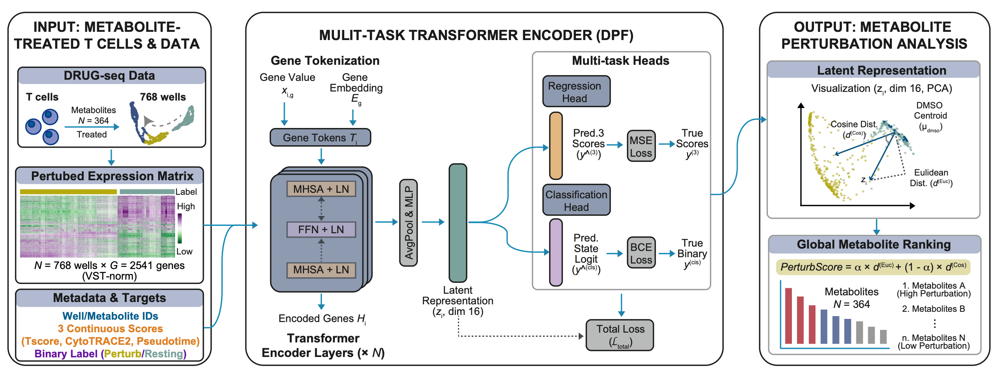

# DRUGseq-PerturbFormer (DPF)

**Multi-task Transformer for metabolite-driven perturbations in T cells**

[](LICENSE)


DRUGseq-PerturbFormer (DPF) models transcriptomic responses of metabolite-treated T cells. A multi-task Transformer learns perturbation scores, latent embeddings, and gene-level attributions that quantify how compounds redirect T-cell states.

DPF produces:
- 🔥 **Perturbation score** (direction/strength of state shift)
- 🧬 **Latent embedding** of sample states
- 📊 **Metabolite ranking + signature extraction**
- ⭐️ **Gene-importance via Grad×Input / Integrated Gradients**

## Overview Graphic
<p align="center">
  
</p>

DRUG-seq profiles feed a shared Transformer encoder. Multi-task heads return continuous phenotypic scores, a binary state logit, perturbation strength, and latent vectors; downstream analyses rank metabolites by their impact on T-cell transcriptional state.

## What It Does
- Loads DRUG-seq expression matrix and metadata (`run_pipeline.py`, `src/data_loader.py`).
- Encodes gene IDs/values with a Transformer (`src/model.py`) and predicts:
  - Three continuous phenotypic scores (`Tscore`, `CytoTRACE`, `Pseudotime`)
  - Binary state logit (resting vs perturbed/activated)
  - Scalar legacy score (historical activation proxy)
  - Latent vector per well
- Training loop with optional z-score, checkpoints, and loss curves (`src/train.py`, `src/plot_loss.py`).
- Exports per-well predictions, metabolite-level latent distances, and Gradient×Input gene importance (`src/export_results.py`, `src/scorer.py`, `src/latent.py`, `src/gene_importance.py`).

## Data Source and Preprocessing
- Platform: DRUG-seq RNA-seq on T cells; each sample is one metabolite-treated well.
- Matrix: $\mathbf{X}\in\mathbb{R}^{N\times G}$ with $N=768$ wells and $G=2541$ VST-normalized, differentially perturbed genes.
- Metadata: metabolite IDs $\text{meta}_i$, well IDs $\text{well}_i$.
- Three continuous phenotypic scores:

$$
\mathbf{y}^{(3)}_i=[\text{Tscore}_i,\ \text{CytoTRACE}_i,\ \text{Pseudotime}_i]
$$

- Binary label: $y^{(\text{cls})}_i \in \{0,1\}$ (Resting vs Altered state).
- Legacy scalar (historical activation-style score) used for regularization:

$$
y^{(\text{old})}_i = \text{scale}(\text{Tscore}_i + \text{CytoTRACE}_i + \text{Pseudotime}_i)
$$

- Input expression is already VST-normalized; optionally z-score with `--use_zscore`.

## Transformer Architecture
**1) Gene-wise tokens**  
Each gene $g$ becomes a token:

$$
\mathbf{t}_{i,g} = \underbrace{\mathbf{W}_v\, x_{i,g}}_{\text{value projection}} + \underbrace{\mathbf{E}_g}_{\text{gene embedding}}
$$

Sequence length $G$ (genes); token dim $d$ (defaults: $d_\text{model}=128$, $n_\text{head}=4$; latent dim $=32$).

**2) Transformer encoder**

$$
\mathbf{H}_i = \text{TransformerEncoder}(\mathbf{T}_i), \quad
\mathbf{T}_i \in \mathbb{R}^{G \times d}
$$

Each layer: $\mathbf{Z} = \text{LN}(\mathbf{T} + \text{MHSA}(\mathbf{T}))$, $\mathbf{H} = \text{LN}(\mathbf{Z} + \text{FFN}(\mathbf{Z}))$.

**3) Pooling to sample representation**

$$
\mathbf{h}_i = \text{AvgPool}(\mathbf{H}_i), \qquad
\mathbf{z}_i = \text{MLP}(\mathbf{h}_i)
$$

$\mathbf{z}_i$ is the latent vector (implementation default latent dim = 32).

## Multi-task Heads and Losses
**Regression (3 scores)**

$$
\hat{\mathbf{y}}^{(3)}_i = \mathbf{W}_3 \mathbf{z}_i + \mathbf{b}_3
$$

MSE loss: $\mathcal{L}_\text{MSE} = \frac{1}{N}\sum_i \lVert \hat{\mathbf{y}}^{(3)}_i - \mathbf{y}^{(3)}_i\rVert_2^2$

**Binary classification (Resting vs Altered)**

$$
\hat{y}^{(\text{cls})}_i = \mathbf{w}_{\text{cls}}^\top \mathbf{z}_i + b_{\text{cls}}
$$

BCE-with-logits: $\mathcal{L}_\text{BCE} = -\frac{1}{N}\sum_i \big[y^{(\text{cls})}_i \log\sigma(\hat{y}^{(\text{cls})}_i) + (1-y^{(\text{cls})}_i)\log(1-\sigma(\hat{y}^{(\text{cls})}_i))\big]$

**Legacy-score regularization**

$$
\hat{y}^{(\text{legacy})}_i = \mathbf{w}_a^\top \mathbf{z}_i + b_a
$$

$$
\mathcal{L}_\text{REG} = \frac{1}{N}\sum_i (\hat{y}^{(\text{legacy})}_i - y^{(\text{old})}_i)^2
$$


**Total loss**

$$
\mathcal{L}_{\text{total}} = \mathcal{L}_\text{MSE} + \mathcal{L}_\text{BCE} + \lambda\,\mathcal{L}_\text{REG}, \quad \lambda=0.2
$$

## Training Setup
- Optimizer AdamW, LR $1\times 10^{-3}$; batch size 32; epochs 50.
- Train/val split: 80/20 stratified by labels; seed 614.
- Logs: Train/Val MSE, BCE, REG, and total loss → `history_loss_detailed.csv`, `loss_curve.png`.

## Latent-space Perturbation Scoring
Post-training latent vectors $\mathbf{z}_i$ (dim 32). Define DMSO center:

$$
\mu_{\text{DMSO}} = \frac{1}{N_\text{DMSO}}\sum_{i\in\text{DMSO}} \mathbf{z}_i
$$

Euclidean and cosine perturbation magnitudes:

$$
d^{(\text{Euc})}_i = \lVert \mathbf{z}_i - \mu_{\text{DMSO}}\rVert_2, \qquad
d^{(\text{cos})}_i = 1 - \frac{\mathbf{z}_i \cdot \mu_{\text{DMSO}}}{\lVert \mathbf{z}_i\rVert_2\,\lVert \mu_{\text{DMSO}}\rVert_2}
$$

Uses: rank metabolite effects, quantify state shifts away from DMSO baseline, correlate with phenotypic scores, and visualize latent structure (PCA/UMAP). Biologically, larger Euclidean distance suggests a broader or stronger transcriptional deviation from baseline, while higher cosine distance highlights changes in the direction of the transcriptomic program (even if overall magnitude is modest), helping separate “how much” a metabolite perturbs from “which pathways” it tilts.

## Gene Importance (Grad×Input or Integrated Gradients)
Per sample saliency (Grad×Input):

$$
\text{saliency}_{i,g} = \left| \frac{\partial \hat{y}^{(\text{legacy})}_i}{\partial x_{i,g}} \cdot x_{i,g} \right|
$$

Global importance:

$$
I_g = \frac{1}{N}\sum_i \text{saliency}_{i,g}
$$

Integrated Gradients (IG) is also available with a configurable baseline (zero or DMSO mean) and target head (`logit` / `scores3` / `latent`). Outputs `gene_importance_gradinput.csv`; highlights genes most sensitive to metabolite-induced perturbations.

## Why This Framework Matters
Supervised, phenotype-aware embeddings let us quantify how metabolites redirect T-cell transcriptional states. Latent distances capture perturbation strength, directions separate shifts, and Grad×Input surfaces candidate genes and pathways—while keeping historical activation-style signals as a regularizer rather than the primary claim.

## Environment Setup
You may use either **Conda** or **Python venv** to create an isolated environment.

---

### **Option A — Recommended: Conda environment**

```bash
conda create -n drugseq-transformer python=3.9 -y
conda activate drugseq-transformer

# Install CUDA-matched PyTorch first if using GPU:
# e.g. for CUDA 12.1:
# conda install pytorch torchvision torchaudio pytorch-cuda=12.1 -c pytorch -c nvidia

pip install -r requirements.txt
```

### **Option B — Using Python venv**

```bash
python -m venv .venv
source .venv/bin/activate   # (Linux/Mac)
# .\.venv\Scripts\activate  # (Windows)

pip install -r requirements.txt
```

## Data Requirements
Expected CSVs under `data/`:
- `expr_mat.csv`: (N, G) expression matrix, columns are genes.
- `scores_3_z.csv`: (N, 3) continuous targets.
- `labels_cls.csv`: (N,) binary labels.
- `meta_id.csv`: (N,) metabolite/condition IDs.
- `well_id.csv`: (N,) well IDs.
- Optional: `activation_score_old.csv` (historical score), `cluster_id.csv` (clusters, used to subset DMSO).

## Run Examples
Train from scratch and export all outputs:
```bash
python run_pipeline.py \
  --epochs 50 \
  --batch_size 32 \
  --data_dir data \
  --out_dir results
```
Common flags:
- `--skip_train`: skip training and load weights from `--model_path`.
- `--use_zscore`: enable z-score normalization of gene expression.
- `--seed`, `--num_threads`: control reproducibility and CPU threading.
- Gene-importance options: `--gi_method {gradinput,ig}` (default gradinput), `--gi_baseline {zero,dmso_mean}`, `--gi_target {logit,act,scores3,latent}`, `--gi_score_index` (when using scores3/latent), `--gi_dmso_meta`, `--gi_dmso_cluster`, `--gi_steps`.

Evaluate an existing model without training:
```bash
python run_pipeline.py --skip_train --model_path results/model.pt
```

Predict on new samples (CSV columns must match training order):
```bash
python predict.py \
  --expr_csv new_expr.csv \
  --meta_csv new_meta.csv \
  --well_csv new_well.csv \
  --model_path results/model.pt \
  --out_csv results/predict_results.csv \
  --dmso_meta DMSO \
  --latent_index 0
```
Output includes predicted phenotypes, classification probability/label, per-dimension latent values, and Euclidean/cosine distances to the DMSO baseline.

## Outputs
Written to `--out_dir`:
- `model.pt` (best), `model_best.pt`, `model_last.pt`
- `well_activation_socres.csv`, `metabolite_activation_scores.csv`
- `well_predictions_results.csv`
- `gene_importance_gradinput.csv`
- `latent_scores.csv`
- If training: `loss_curve.png`, `history_loss_detailed.csv`, `gene_scaler.csv`

## Code Map
- `run_pipeline.py`: orchestrates the full flow.
- `src/model.py`: multi-task Transformer.
- `src/train.py`, `src/dataset.py`: loaders and training loop.
- `src/scorer.py`, `src/latent.py`: latent scoring and distances.
- `src/gene_importance.py`: Grad×Input / Integrated Gradients importance.
- `src/export_results.py`: per-well prediction export.
- `src/plot_loss.py`: loss visualization.
- `src/data_loader.py`, `src/utils_seed.py`: IO and seeding.
- `src/predict_utils.py`: shared utilities for inference.
- `predict.py`: standalone inference CLI for new samples.
