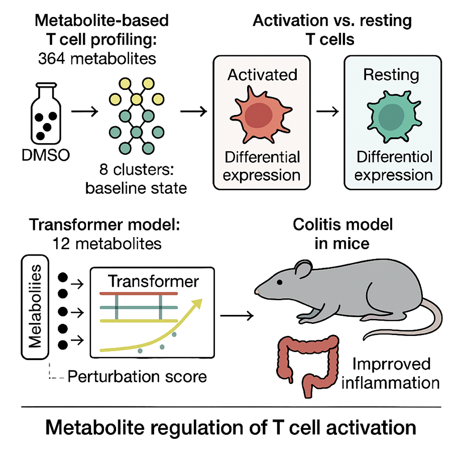

# Tcell_DRUGseq_transformer

English overview of the DRUG-seq multi-task Transformer pipeline for T cell activation profiling. The pipeline trains a transformer encoder on gene expression to jointly learn regression, classification, activation scoring, latent embeddings, and downstream analyses.

## Overview Graphic
<p align="center">
  
</p>

Metabolite-based DRUG-seq profiling feeds a multi-task Transformer that produces perturbation scores and latent embeddings; downstream in vivo colitis models validate top candidates.

## What It Does
- Loads DRUG-seq expression matrix and metadata (`run_pipeline.py`, `src/data_loader.py`).
- Multi-task Transformer (`src/model.py`) that embeds gene IDs/values, encodes with a Transformer, and predicts:
  - Three continuous scores (`Tscore`, `CytoTRACE`, `Pseudotime`)
  - Binary classification logit
  - Scalar activation score
  - Latent vector
- Training loop with z-score option, best/last checkpoints, loss curves (`src/train.py`, `src/plot_loss.py`).
- Exports per-well predictions, metabolite latent scores, latent distances to DMSO, and Gradient×Input gene importance (`src/export_results.py`, `src/scorer.py`, `src/latent.py`, `src/gene_importance.py`).

## Data Source and Preprocessing
- Platform: DRUG-seq T cell RNA-seq expression matrix.
- Each sample = one metabolite-treated well.
- Matrix: $\mathbf{X}\in\mathbb{R}^{N\times G}$ with $N=768$ wells and $G=2541$ VST-normalized, differentially perturbed genes.
- Metadata: metabolite IDs $\text{meta}_i$, well IDs $\text{well}_i$.
- Three continuous activation/differentiation scores:

$$
\mathbf{y}^{(3)}_i=[\text{Tscore}_i,\ \text{CytoTRACE}_i,\ \text{Pseudotime}_i]
$$

- Binary activation label: $y^{(\text{cls})}_i \in \{0,1\}$ (Resting vs Activated).
- Legacy activation score used for regularization:

$$
y^{(\text{old})}_i = \text{scale}(\text{Tscore}_i + \text{CytoTRACE}_i + \text{Pseudotime}_i)
$$

- Input expression already VST-normalized; no extra log/centering applied unless `--use_zscore`.

## Transformer Architecture
**1) Gene-wise tokens**  
Each gene $g$ becomes a token:

$$
\mathbf{t}_{i,g} = \underbrace{\mathbf{W}_v\, x_{i,g}}_{\text{value projection}} + \underbrace{\mathbf{E}_g}_{\text{gene embedding}}
$$

Sequence length $G$ (genes), token dim $d$ (code defaults: $d_\text{model}=128$, $n_\text{head}=4$; latent dim $=32$).

**2) Transformer encoder**

$$
\mathbf{H}_i = \text{TransformerEncoder}(\mathbf{T}_i), \quad
\mathbf{T}_i \in \mathbb{R}^{G \times d}
$$

Each layer: $\mathbf{Z} = \text{LN}(\mathbf{T} + \text{MHSA}(\mathbf{T}))$, $\mathbf{H} = \text{LN}(\mathbf{Z} + \text{FFN}(\mathbf{Z}))$.

**3) Pooling to sample representation**

$$
\mathbf{h}_i = \text{AvgPool}(\mathbf{H}_i), \qquad
\mathbf{z}_i = \text{MLP}(\mathbf{h}_i)
$$

$\mathbf{z}_i$ is the latent vector (implementation default latent dim = 32; conceptual description above mentions 16).

## Multi-task Heads and Losses
**Regression (3 scores)**

$$
\hat{\mathbf{y}}^{(3)}_i = \mathbf{W}_3 \mathbf{z}_i + \mathbf{b}_3
$$

MSE loss: $\mathcal{L}_\text{MSE} = \frac{1}{N}\sum_i \lVert \hat{\mathbf{y}}^{(3)}_i - \mathbf{y}^{(3)}_i\rVert_2^2$

**Binary classification (Activated vs Resting)**

$$
\hat{y}^{(\text{cls})}_i = \mathbf{w}_{\text{cls}}^\top \mathbf{z}_i + b_{\text{cls}}
$$

BCE-with-logits: $\mathcal{L}_\text{BCE} = -\frac{1}{N}\sum_i \big[y^{(\text{cls})}_i \log\sigma(\hat{y}^{(\text{cls})}_i) + (1-y^{(\text{cls})}_i)\log(1-\sigma(\hat{y}^{(\text{cls})}_i))\big]$

**Activation regularization (legacy score)**

$$
\hat{y}^{(\text{act})}_i = \mathbf{w}_a^\top \mathbf{z}_i + b_a
$$

$\mathcal{L}_\text{REG} = \frac{1}{N}\sum_i (\hat{y}^{(\text{act})}_i - y^{(\text{old})}_i)^2$

**Total loss**

$$
\mathcal{L}_{\text{total}} = \mathcal{L}_\text{MSE} + \mathcal{L}_\text{BCE} + \lambda\,\mathcal{L}_\text{REG}, \quad \lambda=0.2
$$

## Training Setup
- Optimizer AdamW, LR $1\times 10^{-3}$; batch size 32; epochs 50.
- Train/val split: 80/20 stratified by labels; seed 614.
- Logs: Train/Val MSE, BCE, REG, and total loss → `history_loss_detailed.csv`, `loss_curve.png`.

## Latent-space Perturbation Scoring
Post-training latent vectors $\mathbf{z}_i$ (dim 32). Define DMSO center:

$$
\mu_{\text{DMSO}} = \frac{1}{N_\text{DMSO}}\sum_{i\in\text{DMSO}} \mathbf{z}_i
$$

Euclidean and cosine perturbation magnitudes:

$$
d^{(\text{Euc})}_i = \lVert \mathbf{z}_i - \mu_{\text{DMSO}}\rVert_2, \qquad
d^{(\text{cos})}_i = 1 - \frac{\mathbf{z}_i \cdot \mu_{\text{DMSO}}}{\lVert \mathbf{z}_i\rVert_2\,\lVert \mu_{\text{DMSO}}\rVert_2}
$$

Uses: rank metabolite effects, distinguish activation vs inhibition, correlate with phenotype scores, visualize latent structure (PCA/UMAP).

## Gene Importance via Gradient × Input
Per sample saliency:

$$
\text{saliency}_{i,g} = \left| \frac{\partial \hat{y}^{(\text{act})}_i}{\partial x_{i,g}} \cdot x_{i,g} \right|
$$

Global importance:

$$
I_g = \frac{1}{N}\sum_i \text{saliency}_{i,g}
$$

Outputs `gene_importance_gradinput.csv`; highlights activation drivers, drug targets, and candidate markers.

## Why This Framework Matters
Supervised phenotype-driven embedding: latent space encodes drug-induced transcriptomic shifts tied directly to activation/differentiation phenotypes. Distances quantify perturbation strength; directions separate activation vs inhibition; embeddings and Grad×Input reveal key genes; multi-task heads deliver numeric scores and class boundaries while retaining prior knowledge via regularization.

## Key Formulas
**Z-score normalization (optional) for input genes**

$$
x_{i,g}^{(z)} = \frac{x_{i,g} - \mu_g}{\sigma_g + 10^{-8}}
$$

where $\mu_g, \sigma_g$ are computed on the training split.

**Multi-task loss (per batch) combining regression, classification, and optional activation regularization**

$$
\mathcal{L} = \text{MSE}(y^{(3)}, \hat{y}^{(3)}) + \text{BCEWithLogits}(y^{(\text{cls})}, \hat{y}^{(\text{cls})}) + \lambda_{\text{reg}} \,\text{MSE}(y^{(\text{act-old})}, \hat{y}^{(\text{act})})
$$

with $\lambda_{\text{reg}} = 0.2$ when historical activation scores exist.

**Latent norm score per sample**

$$
s_{\text{latent}} = \lVert z \rVert_2
$$

Aggregated by metabolite (mean/std/count) for ranking.

**Latent distance to DMSO center**

$$
\mu_{\text{DMSO}} = \frac{1}{N_{\text{DMSO}}} \sum_{i \in \text{DMSO}} z_i
$$

$$
d_{\text{euclid}}(i)=\lVert z_i - \mu_{\text{DMSO}}\rVert_2, \qquad d_{\text{cos}}(i)=1-\frac{z_i \cdot \mu_{\text{DMSO}}}{\lVert z_i\rVert_2\,\lVert \mu_{\text{DMSO}}\rVert_2}
$$

**Gradient×Input gene importance (global average over samples)**

$$
\text{GI}_g = \frac{1}{N} \sum_{i=1}^{N} \left| x_{i,g} \,\frac{\partial \hat{a}_i}{\partial x_{i,g}} \right|
$$

where $\hat{a}_i$ is the predicted activation scalar.

## Environment Setup
1. Python 3.9+ recommended. Create a virtual environment:
   ```bash
   python -m venv .venv
   source .venv/bin/activate
   ```
2. Install dependencies (for GPU, install the CUDA-matched PyTorch wheel first if needed):
   ```bash
   pip install -r requirements.txt
   ```

## Data Requirements
Expected CSVs under `data/`:
- `expr_mat.csv`: (N, G) expression matrix, columns are genes.
- `scores_3_z.csv`: (N, 3) continuous targets.
- `labels_cls.csv`: (N,) binary labels.
- `meta_id.csv`: (N,) metabolite/condition IDs.
- `well_id.csv`: (N,) well IDs.
- Optional: `activation_score_old.csv` (historical activation), `cluster_id.csv` (clusters, used to subset DMSO).

## Run Examples
Train from scratch and export all outputs:
```bash
python run_pipeline.py \
  --epochs 50 \
  --batch_size 32 \
  --data_dir data \
  --out_dir results
```
Common flags:
- `--skip_train`: skip training and load weights from `--model_path`.
- `--use_zscore`: enable z-score normalization of gene expression.
- `--seed`, `--num_threads`: control reproducibility and CPU threading.

Evaluate an existing model without training:
```bash
python run_pipeline.py --skip_train --model_path results/model.pt
```

## Outputs
Written to `--out_dir`:
- `model.pt` (best), `model_best.pt`, `model_last.pt`
- `well_activation_socres.csv`, `metabolite_activation_scores.csv`
- `well_predictions_results.csv`
- `gene_importance_gradinput.csv`
- `latent_scores.csv`
- If training: `loss_curve.png`, `history_loss_detailed.csv`, `gene_scaler.csv`

## Code Map
- `run_pipeline.py`: orchestrates the full flow.
- `src/model.py`: multi-task Transformer.
- `src/train.py`, `src/dataset.py`: loaders and training loop.
- `src/scorer.py`, `src/latent.py`: latent scoring and distances.
- `src/gene_importance.py`: Gradient×Input importance.
- `src/export_results.py`: per-well prediction export.
- `src/plot_loss.py`: loss visualization.
- `src/data_loader.py`, `src/utils_seed.py`: IO and seeding.
